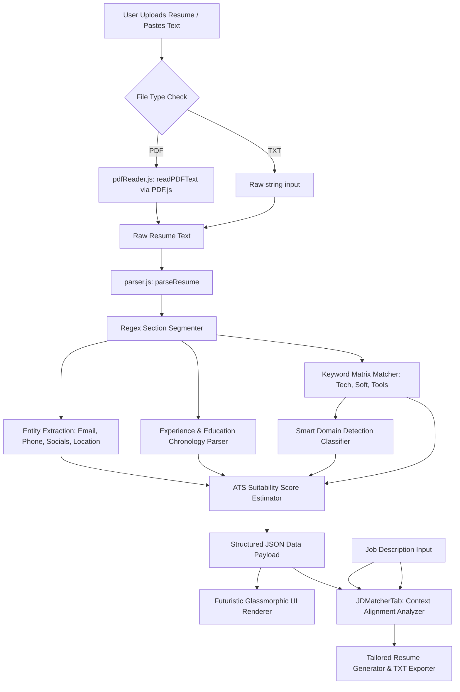

# NexusParse: Technical Workflow & Architecture

NexusParse is an **offline-first, zero-network, high-performance client-side resume parser**. All extraction, domain classification, ATS scoring, and job description mapping are executed locally within the user's browser runtime.



---

## 1. Data Ingestion & Extraction Workflow

### A. PDF Text Extraction (`pdfReader.js`)
- **Engine**: Mozilla's `pdfjs-dist` (PDF.js).
- **Process**: 
  - Reads the file binary array buffer on the client-side using `FileReader`.
  - Iterates through the document pages asynchronously.
  - Queries `page.getTextContent()` to extract layout streams of characters.
  - Reconstructs coordinates and spacing into structured multiline text content.

### B. Segment Parsing (`parser.js: extractSections`)
- Uses regular expression headers to divide the raw string into semantic zones:
  ```javascript
  const sectionHeaders = /^(?:#{1,3}\s*)?(?:\*{0,2})(experience|work\s*(?:experience|history)|education|academic|skills|technical\s*skills|certifications?|projects?|summary|profile)/im
  ```

---

## 2. Advanced AI & Classification Core

### A. Smart Domain Detection Classifier (`detectDomain`)
- Computes matching keyword densities across a corpus of resume summaries, titles, and project bullet points.
- Assigns specific category scores to identify candidate profiles accurately:
  * **AI & Machine Learning**: High density of `deep learning`, `neural network`, `tensorflow`, `pytorch`, `keras`, `xgboost`, `lightgbm`, `bert`, `llm`, `transformers`, `reinforcement learning`, `model training`, `artificial intelligence`.
  * **Computer Vision**: Detects `opencv`, `yolo`, `image processing`, `object detection`.
  * **Natural Language Processing**: Detects `nlp`, `tokenization`, `bert`, `named entity`.
  * **Full Stack / Frontend / Backend**: Detects relative density of frameworks (`react`, `angular`, `next.js` vs `node`, `express`, `django`, `flask`).
  * **Compound Profiles**: Formulates hybrid domains like **AI & Computer Vision** or **AI & NLP Engineering** if score matrices cross threshold limits.

### B. ATS Score Suitability Index (`calculateATSScore`)
Evaluates structural resume readiness across a 100-point scale:
- **Contact Completeness (20%)**: Ensures presence of email, phone, location, and professional links (GitHub/LinkedIn).
- **Summary Depth (10%)**: Checks for a concise, meaningful professional bio (>50 chars).
- **Skills Richness (20%)**: Computes variety of technical, tooling, and soft skills.
- **Experience Chronology (20%)**: Audits number of past positions and detailed bullet lists.
- **Academic Credentials (15%)**: Looks for degrees and certification issuers.
- **Formatting Hygiene (15%)**: Assesses section naming alignments and bullet symbol formatting.

---

## 3. Real-time Tailoring & Optimization (`JDMatcherTab.jsx`)

When a user provides a target Job Description (JD):
1. **Overlap Matrix**: The matcher compares the extracted resume vocabulary with the JD text to isolate matched terms vs missing requirements.
2. **Readiness Index**: Dynamically modifies the suitability score.
3. **Tailored Translation**: Generates an optimized role summary, professional bullet points, and suggests additional keyword injections.
4. **Local Exporter**: Packs the tailored profile into a structured plain text file (`.txt`) using client-side `Blob` streams.
